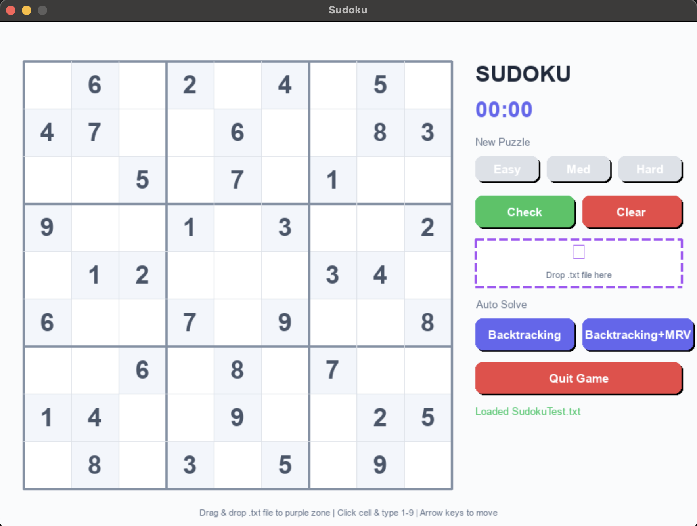
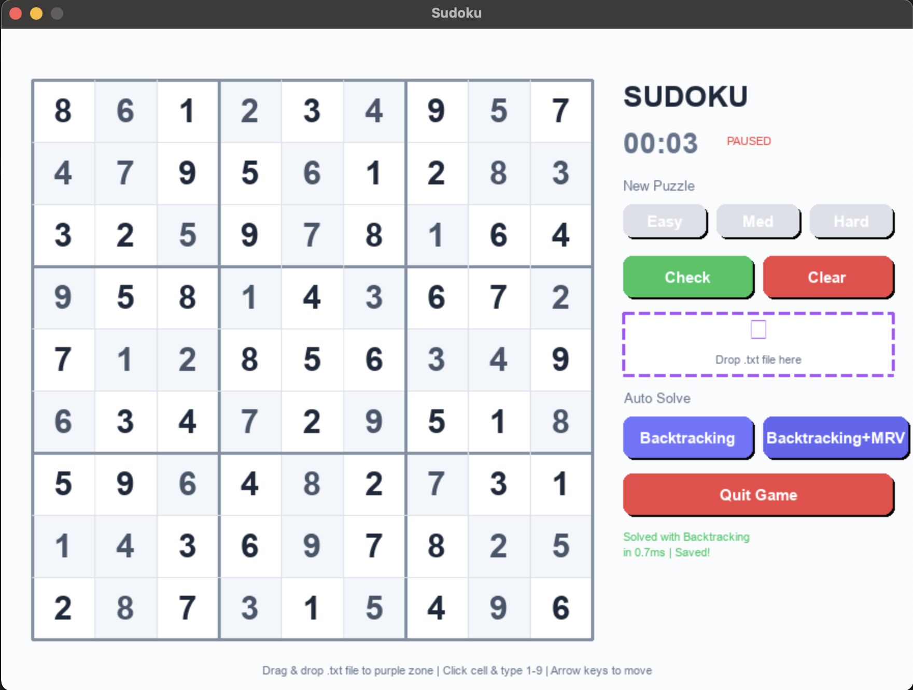
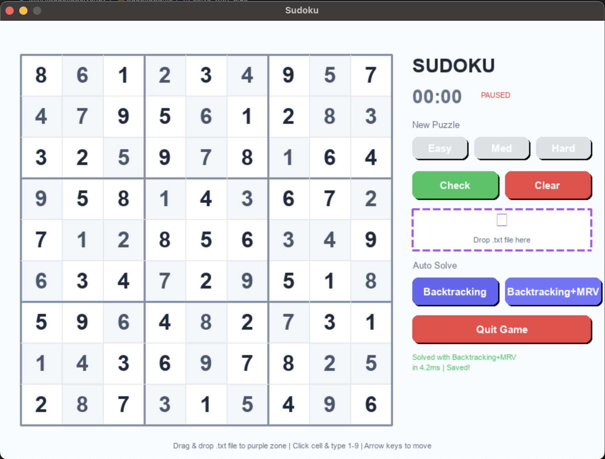

# 🧩 MMAI Sudoku Solver

## Kelompok 3
## 👥 Daftar Anggota
1. Anis Raysa (250820701100003)
2. Zahra Zafira (2208107010040)
3. Cut Sula Fhatia Rahma (2208107010048)

---

## 📂 Struktur Proyek

Proyek ini merupakan implementasi **program penyelesai Sudoku** menggunakan Python. Program dikembangkan untuk memenuhi tugas mata kuliah **Artificial intelligence**, dengan pendekatan algoritmik yang mengombinasikan **Backtracking** dan **MRV (Minimum Remaining Values)** sebagai strategi pencarian solusi.

---
```bash
## 📂 Struktur Proyek 

├── MMAISudokuSolver.py # File utama program Sudoku Solver
├── SudokuTest.txt # File input puzzle Sudoku (opsional)
├── requirements.txt # File yg berisi requirements
├── assets/
│ ├── TampilanSudoku.png
│ └── HasilSolver_Backtraking.png
│ └── HasilSolver_Backtraking+MRV.png
└── README.md # Dokumentasi penggunaan
```
---

## ⚙️ Algoritma yang Digunakan

1. **Backtracking Search**

   - Algoritma brute force dengan mencoba setiap angka 1–9 pada sel kosong.
   - Melakukan backtrack jika ditemukan konflik pada aturan Sudoku (baris, kolom, subgrid 3x3).

2. **MRV (Minimum Remaining Values)**
   - Heuristik untuk memilih variabel (sel kosong) dengan jumlah kemungkinan nilai paling sedikit.
   - Mempercepat proses pencarian dengan meminimalisir cabang yang perlu diuji.

---

## 📝 Format File Puzzle Input

File puzzle menggunakan angka 0 untuk sel kosong. Contoh:
```bash
0 6 0 2 0 4 0 5 0
4 7 0 0 6 0 0 8 3 
0 0 5 0 7 0 1 0 0 
9 0 0 1 0 3 0 0 2 
0 1 2 0 0 0 7 4 0 
8 0 0 7 0 5 0 0 6 
0 0 6 0 4 0 5 0 0 
7 2 0 0 5 0 0 6 4 
0 4 0 9 0 7 0 1 0 
```

---

## 📚 Library yang Digunakan

- **pygame** → untuk menampilkan antarmuka grafis Sudoku (jika mode GUI diaktifkan).
- **sys, os** → untuk manajemen sistem file dan runtime.
- **time** → untuk pengukuran waktu eksekusi.
- **random, copy** → untuk kebutuhan manipulasi puzzle tambahan.

---

## ▶️ Cara Menjalankan Program

### 1. Setup Environment

Pastikan Python sudah terinstal.  
Buat virtual environment :

```bash
python3 -m venv venv_sudoku
source venv_sudoku/bin/activate   # Linux/Mac
venv_sudoku\Scripts\activate      # Windows
```

### 2. Install Requirements

Install requirement.txt

```bash
pip install -r rerequirements.txt
```

### 3. Jalankan Program

```bash
python MMAISudokuSolver.py
```

---

## 🖼️ SS Tampilan

### Tampilan Game



### Hasil Solver Dengan Algoritma Backtracking



### Hasil Solver Dengan Algoritma Backtracking+MRV


